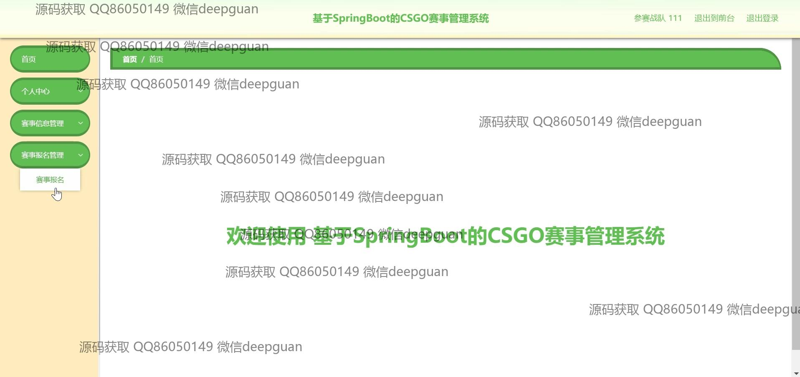

<h1 align="center">基于SpringBoot的CSGO赛事管理系统</h1>

## 简介
基于SpringBoot的CSGO赛事管理系统，角色分为管理员与用户；功能包括赛事信息管理、参赛战队管理、用户注册与登录、赛事报名与审核、合作方管理，提供简洁高效的赛事组织与管理体验。    --计算机毕业设计源码；毕设源码；java毕业设计源码

## 联系方式

<h3 align="center">获取完整代码与数据库文件 + 微信：deepguan QQ: 86050149 QQ群: 783742310</h3>

<h3 align="center">可帮忙远程部署 包运行成功！提供远程部署、修改代码、设计文档指导、代码讲解等服务！</h3>

## 功能介绍（完整见运行截图）
管理员：管理CSGO赛事，包括赛事的增加、删除、修改和审核，通过系统界面方便地进行赛事信息的录入、队伍管理、赛事阶段管理和赛事结果录入。支持用户管理，审核参赛队伍和合作方申请，确保信息的真实性和完整性。通过赛事信息管理模块，管理员可以查看和编辑赛事名称、举办地、时间安排等详细信息，并通过用户界面轻松操作和导航，从而保持赛事组织的高效性和准确性。此外，管理员可以通过系统的导航栏访问个人中心、合作方管理、系统设置等功能模块，实现对系统的全面调控。

参赛战队：提供注册和登录功能，战队可以通过系统提交参赛申请并注册参赛账号。注册过程中需要提供战队名称、联系方式、邮箱和所属国家等信息。在赛事管理系统中，战队可查看即将进行的比赛详情、报名参赛、管理队伍信息和查看比赛结果及排名。战队还可以通过系统对比赛的时间安排和赛事通知进行查询，确保参赛计划与赛事安排同步。同时，参赛战队可以在个人中心管理自己的注册信息和查看系统通知，进行信息维护和参赛调整。

合作方：合作方可以通过系统界面进行注册和登录，获取赛事相关信息和合作项目机会。系统提供合作管理模块，合作方可以申请项目合作，通过合作方管理功能查看或更新公司信息，提交相关资料供管理员审核。合作方在系统中也能查看赛事信息，了解比赛地点、时间安排、合作活动的细节等，以便与赛事组织方进行协调和沟通。合作方有权限使用系统中的导航功能来访问个人中心、系统通知和合作申请管理等模块，推动合作项目的进展与实施。

普通用户：普通用户可以通过注册和登录访问系统的基本功能，查看赛事信息、比赛详情和结果统计。系统的导航栏帮助用户轻松浏览赛程、参赛队伍信息和赛事通知。普通用户可以查询已注册赛事和报名状态，通过个人中心进行个人信息管理和参赛状态查看。普通用户也能以观察者的身份参观赛事的安排和合作方的资讯，利用系统提供的功能如赛事关系图、报名表格和详细的赛事活动说明，为自身的观看和参与提供更多参考，提高用户体验和参与感。

## 运行截图

本代码来源于网络,仅供学习参考使用!

